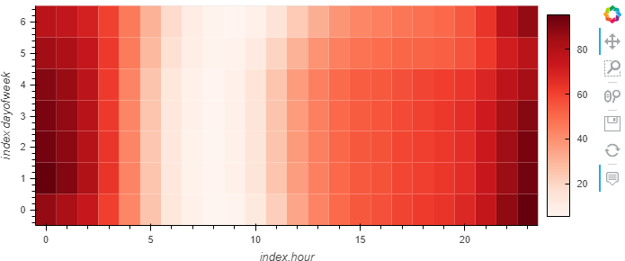
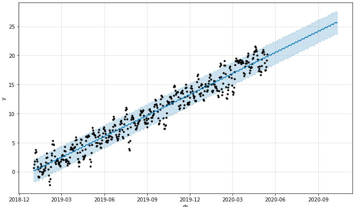
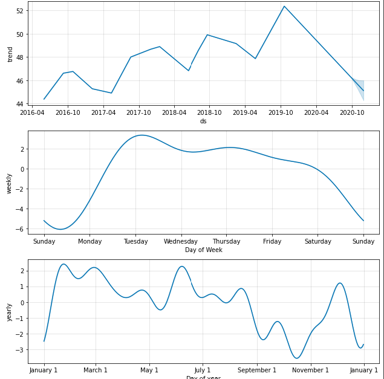

# forcasting_profit
Analyzing MercadoLibre's financial and user data wiht prophet to help the company grow.

---

## Technologies

This project leverages python 3.7 with the following packages:

* [pandas] (https://github.com/pandas-dev/pandas) - For data manipulation and analysis.

* [hvplot] (https://github.com/holoviz/hvplot) - For high-level plotting.

* [pathlib] (https://github.com/budlight/pathlib) - For importing cvs files using standarized file path notation.

* [holoviews] (https://github.com/holoviz/holoviews) - For seamless and simple data visualization.

* [prophet] (https://facebook.github.io/prophet/) - For automated forecasts that can be tuned by hand.

* [numpy] (https://github.com/numpy/numpy) - For scientific computing.

---

## Datasets

Dataset pulled from Resources folder which contains csv files.

## Usage

### General

Upon launching the forecasting_net_prophet.ipynb run each cell sequentially, ensuring to import the required libraries. To run this using google colab ensure to put hv.extension('bokeh') in the cells where hvplot is used.

### Analysis

This graph is a heatmap that displays the times during the day which search traffic is highest and lowest.

This is the resulting forcast of sales 150 days in the future using Prophet.

These are the daily and weekly trends from search volume to determine seasonality.

